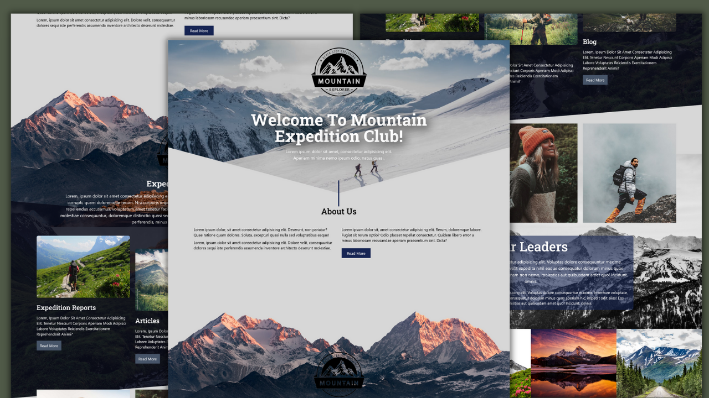

## Create an Engaging Travel Landing Page with React JS, Framer Motion, and GSAP: A Beginner's Guide

## Demo 
[Travel Website](https://travel-website12.netlify.app/)
[YouTub Video](https://youtu.be/KrMNf2DLX00)

## Description
Travel website is a static website build using React JS, Tailwind CSS, Framer-Motion as well as GSAP. This project is build for youtube channel and the teaches the beghinners the basic of React JS with the combination of Tailwind css and some Animation libraries.
